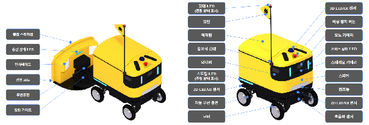
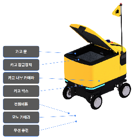

## 1.1 Product Introduction

This document is a guideline for the smooth operation and management of the ANTBot 5th Generation hardware platform provided by ROBOTIS AI. This platform supports a Swerve Drive system and ROS 2 Humble environment, optimized for research and service development.

## 1.2 Structure Diagram

## 1.3 Hardware Specifications

| Item | Part Name | Qty | Details |
| --- | --- | --- | --- |
| Flag | Flag LED B/D | 1 | Outsourced LED board, wired power cable |
| Router/Antenna | CNR-5G500 | 1 | Gen 4.1 running change model |
| Indicator LED | LED Strip DC 24V RGB Non-waterproof 5M | 2 | Gen 4.1 LED STRIP |
| Wiper | XC330-M288-T | 3 | Same as Gen 4.1 |
| Mono Camera | CAMERA_RE-26OC w/2.6mm Lens | 3+1 | Front, left/right cargo cameras, rear camera |
| Depth Camera | Gemini 336L | 1 | |
| Eye LED | GAEMI_1_G41_LED MATRIX_PBA | 2 | Same as Gen 4.1, wired power cable |
| Head Light | Head Light_CS-B1860W | 1 | Same spec as Gen 4.1 |
| 2D LiDAR | Coin-D4 | 2 | |
| 3D LiDAR | Vanjee WLR-722 | 1 | |
| Ultrasonic Sensor | DYP-A02YYMW02.0 | 2 | |
| Wireless Charging Module | RX(GAEMI 5.0) / TX(Charging Station) | 1+1 | |
| Emergency Switch | KSE-4RB3 | 1 | Same as Gen 4.1 |
| Door Locker | STD-06AS-12 | 1 | Chamfered latch design |
| In Wheel Motor | ZLLG80ASM250-4096-B | 4 | Same as Gen 4.0 |
| Swerve Motor | XD540-W270-T | 4 | Belt pulley structure |
| Speaker | MS878701CC-CX001 | - | New specification |
| Fan | System cooling / Component cooling / Battery cooling | Multiple | |
| Battery Pack | LFP BATTERY | 1 | Cell model: TPT140146295F70 |
| GNSS Antenna | GNSS Antenna_1-SMA male | 1 | |
| Power Switch | QN16-B1-PUSH | 1 | |

## 1.4 Product Specifications

| Item | Details |
| --- | --- |
| Size / Weight | L762 x W582 x H766 (with Flag 1,373) mm / 62.1kg |
| Cargo Volume | L410 x W410 x H320 mm, 53.8L |
| Load Capacity (Recommended/Max) | Under 10kg recommended / Max 20kg |
| Driving Speed | 0.5 ~ 2.0 m/s |
| Step Clearance | Max 90mm (under 5kg) / 50mm (at 20kg) |
| Climbing Angle | 15° |
| Continuous Operation / Charging | 0h / 0h |
| Battery Type / Count / Capacity / Rating | LFP / 1 pack / 65Ah / 25.6V |
| Charging Method | Wireless autonomous charge |
| Operating Temp / Communication | -10 ~ 40°C (Cold Start 0 ~ 40°C) / 5G (LTE-CA) |
| Steering Type | Swerve (AWD) |
| Cargo Type | Single (manual open/close) |
| Waterproof Rating | IPX4 |
| Certifications (Planned) | Outdoor mobile robot safety certification, KC, KS B 7317 (in progress) |
| Operating System | ROS 2 |
| Other | Fleet management integration, night driving (headlights), crosswalk traversal, LED, etc. |

## 1.5 Sensor Coordinate Reference

| Sensor | Position | X | Y | Z | Roll | Pitch | Yaw |
| :---: | :---: | :---: | :---: | :---: | :---: | :---: | :---: |
| Unit | | mm | | | degree(°) | | |
| Mono Cam | LEFT | 260.000 | 258.950 | 584.500 | 0 | 0 | -90 |
| | CENTER | 362.250 | 0 | 584.500 | 0 | 0 | 0 |
| | RIGHT | 260.000 | -258.950 | 584.500 | 0 | 0 | 90 |
| | BACK | -373.500 | 0 | 296.000 | 0 | 180 | 0 |
| Depth Cam | CENTER | 348.563 | 0 | 526.200 | 0 | 30 | 0 |
| LiDAR | 2D FRONT | 320.000 | 0 | 252.000 | 180 | 0 | 0 |
| | 2D BACK | -320.000 | 0 | 252.000 | 0 | 180 | 0 |
| | 3D | 225.233 | 0 | 721.313 | 0 | 10 | -90 |
| IMU (RCU U60) | | 240.000 | 0 | 379.200 | 0 | 0 | 180 |
| GNSS | | 202.600 | -128.000 | 657.000 | 0 | 0 | 180 |
| Magnetometer (RCU U59) | | 240.000 | -11.000 | 379.200 | 0 | 0 | 0 |
| Wireless Charging Coil | | -299.000 | 0 | 170.627 | 0 | 0 | 0 |
