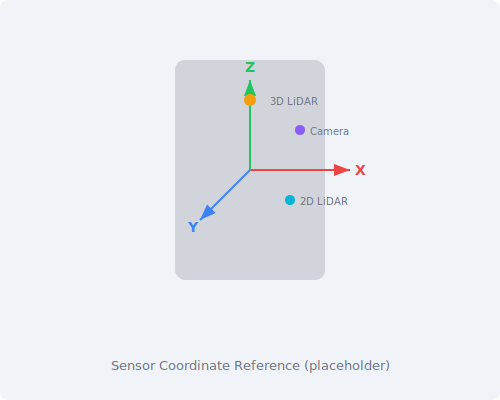

| **구분**               |          | **X**    | **Y**    | **Z**   | **Roll**  | **Pitch** | **Yaw** |
| ---------------------- | -------- | -------- | -------- | ------- | --------- | --------- | ------- |
| 단위                   |          | mm       |          |         | degree(˚) |           |         |
| Mono Cam               | LEFT     | 260.000  | 258.950  | 584.500 | 0         | 0         | -90     |
|                        | CENTER   | 362.250  | 0        | 584.500 | 0         | 0         | 0       |
|                        | RIGHT    | 260.000  | -258.950 | 584.500 | 0         | 0         | 90      |
|                        | BACK     | -373.500 | 0        | 296.000 | 0         | 180       | 0       |
| Depth Cam              | CENTER   | 348.563  | 0        | 526.200 | 0         | 30        | 0       |
| LiDAR                  | 2D FRONT | 320.000  | 0        | 252.000 | 180       | 0         | 0       |
|                        | 2D BACK  | -320.000 | 0        | 252.000 | 0         | 180       | 0       |
|                        | 3D       | 225.233  | 0        | 721.313 | 0         | 10        | -90     |
| IMU (RCU U60)          |          | 240.000  | 0        | 379.200 | 0         | 0         | 180     |
| GNSS                   |          | 202.600  | -128.000 | 657.000 | 0         | 0         | 180     |
| Magnetometer (RCU U59) |          | 240.000  | -11.000  | 379.200 | 0         | 0         | 0       |
| Wireless Charging Coil |          | -299.000 | 0        | 170.627 | 0         | 0         | 0       |
